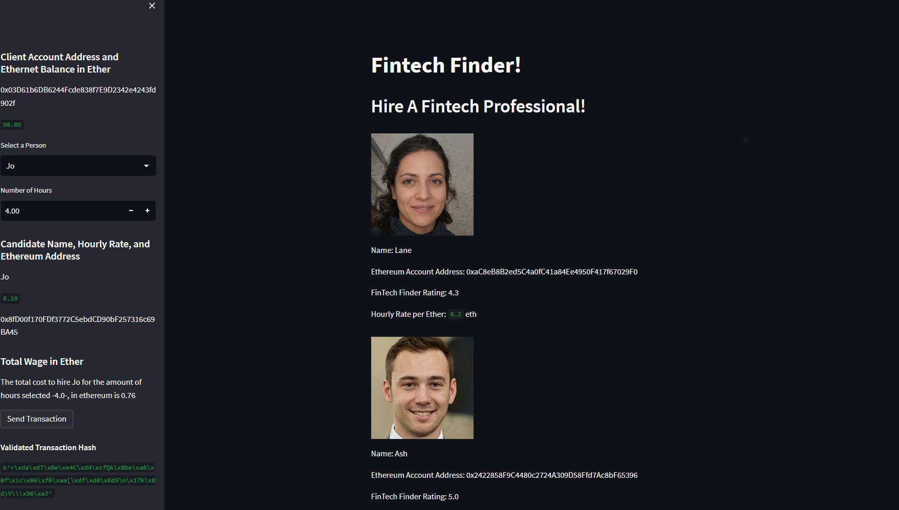
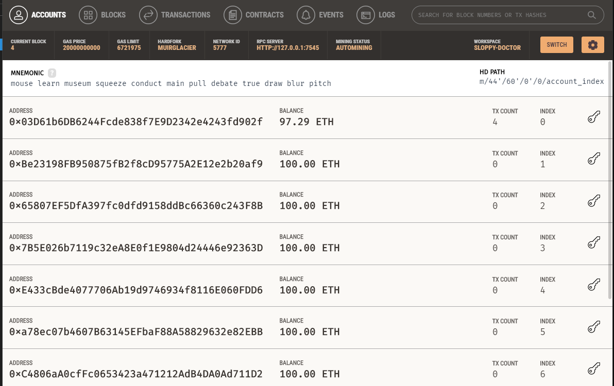
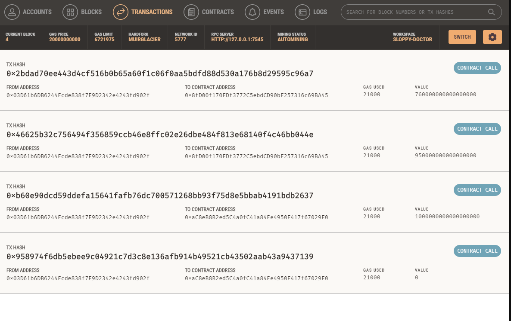
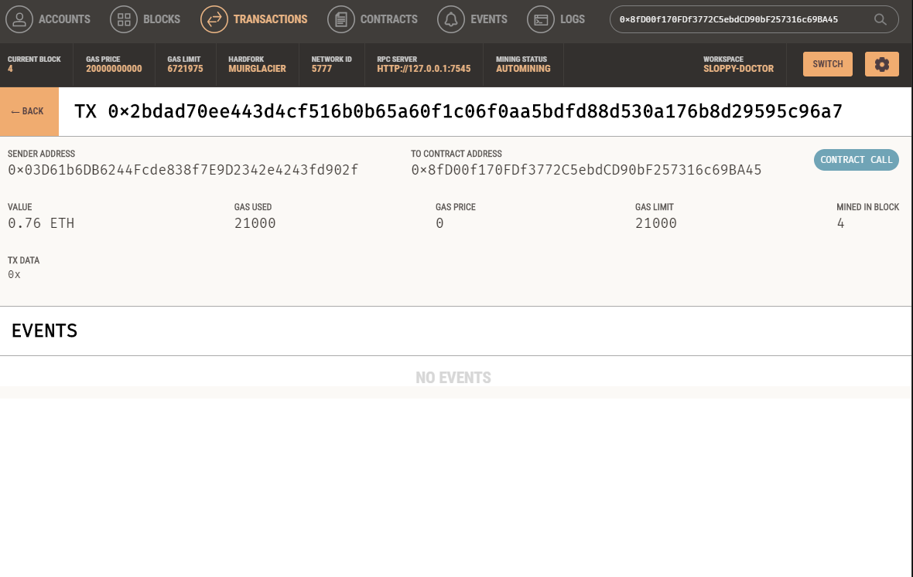

# Fintech-finder
## Project Description

---
Challenge 19 for Fintech bootcamp through UC Berkeley. Using python to connect to a ganache test RPC and streamlit to display a web-app for fintech developers, to simulate paying someone ETH for online development work. This project contains two main files, `crypto_wallet.py` and `fintech_finder.py`. Where the former has all the functions related to connecting to the ganache RPC, and the later has the code and functions for launching the streamlit application you can see below. 

Once it was up and running I sent some test transactions just to make sure it was working and you can see the resulting transaction below through ganache. 

I tried sending ETH four different times and you can see the resulting transactions in the images above. If you want to get this running locally yourself and mess around with it follow along below.

---

## Package Requirements and versions
First before installing any packages and getting setup make sure you are in a `dev` environment or an environment you are comfortable downloading packages into. If you don't know what a `dev` environment is follow along below. 
To get your `dev` environment setup do the following in your command line:

- Creating a dev environment for python 3.7 called 'dev' - if you do not already have an environment setup 
    - Get setup in your preferred CLI (Gitbash, terminal, etc)
    - `conda create -n dev python=3.7 anaconda`
    - Once you have created the environment, type the following to activate and deactivate.

Once you have cloned the repo and have a `dev` or similar env with python 3.7 or higher the next step is to make sure you have the packages installed locally. Navigate to the newly cloned repo and make sure you are in the right directory. 
Packages needed are listed below
- streamlit :`pip install streamlit`
- web3:`pip install web3==5.17`
- mnemonic: `pip install mnemonic`
- bip44: `pip install bip44`

Once you have those packages and are in the right directory with your preferred CLI tool, simply type `streamlit run fintech_finder.py` and a local host should appear shortly looking like the screenshot in the start of this readme!

---

## Contributors

[Robin Thorsen](https://www.linkedin.com/in/robin-thorsen-079819120/) was the developer who worked on this project. 

---

## License

Apache 2.0 public License applied, feel free to clone and fork and use and reach out if you have questions. 

